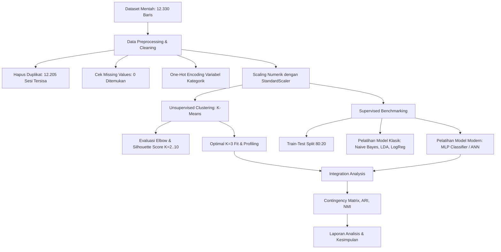
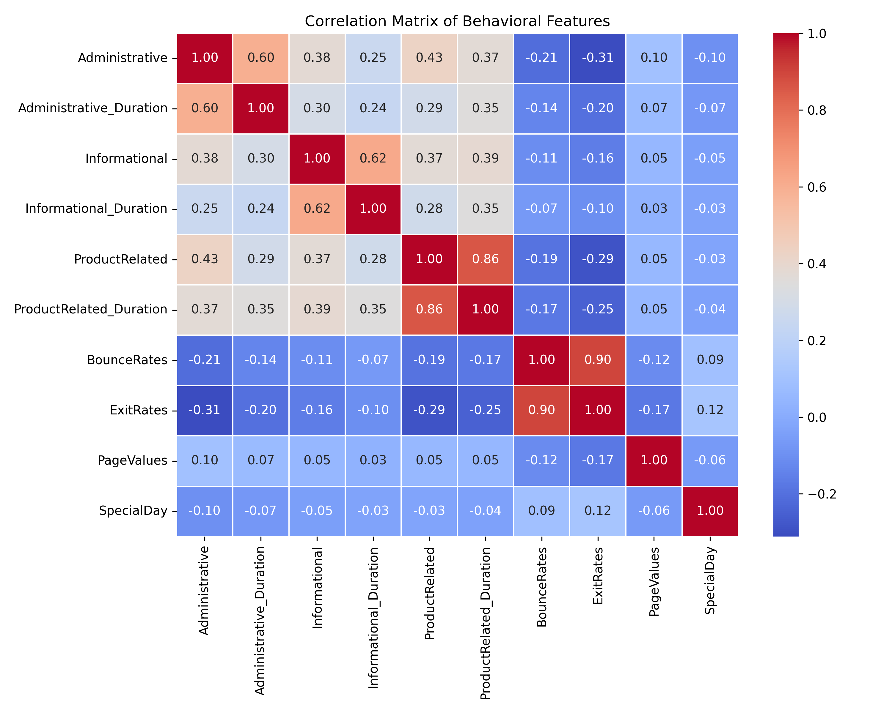
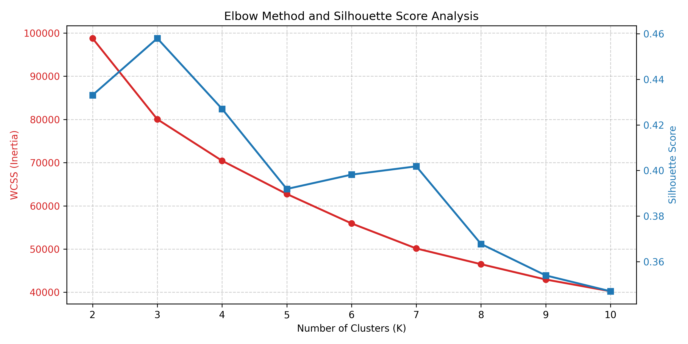
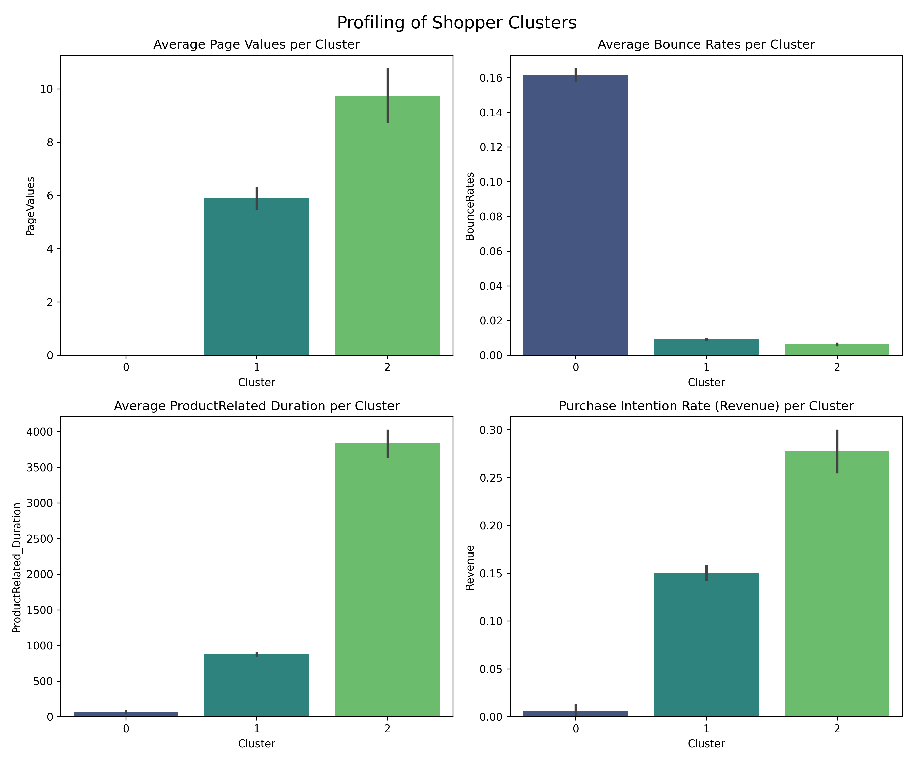
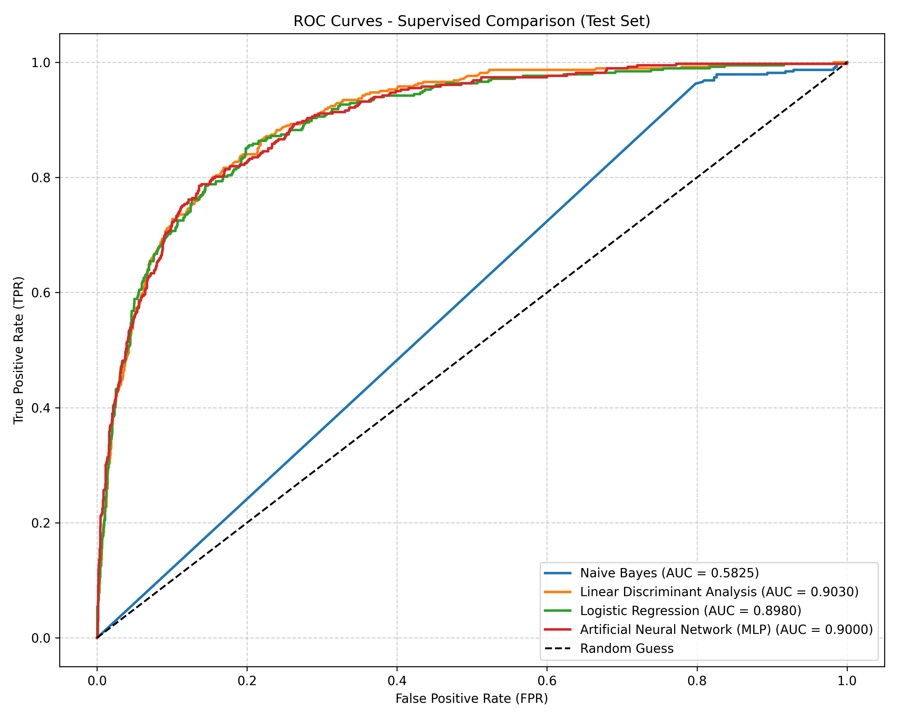
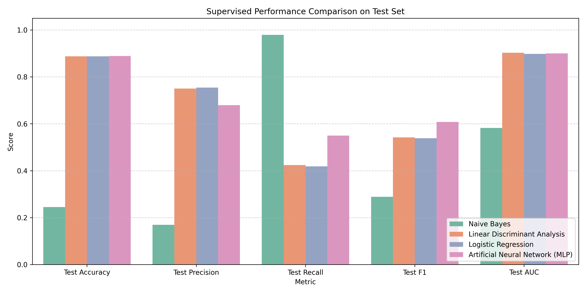

# LAPORAN TUGAS AKHIR / UJIAN AKHIR SEMESTER (UAS)
## INTEGRATED MACHINE LEARNING BENCHMARK PADA DATASET ONLINE SHOPPERS PURCHASING INTENTION

---

### ABSTRAK

Penelitian ini bertujuan untuk melakukan analisis komprehensif secara *end-to-end* pada dataset *Online Shoppers Purchasing Intention* menggunakan pendekatan gabungan *Unsupervised Learning* untuk segmentasi perilaku pelanggan dan *Supervised Learning* untuk klasifikasi prediksi niat beli. Pada tahap rekayasa data (*data engineering*), data dibersihkan dari duplikasi, diperiksa terhadap nilai kosong (*missing values*), dikodekan melalui binerisasi dan *One-Hot Encoding*, serta dinormalisasi ke dalam *Vector Space* menggunakan *StandardScaler*. Tahap *unsupervised learning* mengimplementasikan algoritma K-Means dengan pemilihan jumlah klaster optimal berbasis evaluasi kurva Elbow (inersia) dan *Silhouette Score*. Hasil klasterisasi terbaik diperoleh pada jumlah klaster $K=3$, yang mengelompokkan sesi kunjungan pengguna menjadi tiga segmen logis: *Bounce/Uninterested Visitors* (Klaster 0), *Browsing/Potential Buyers* (Klaster 1), dan *High-Intent Buyers* (Klaster 2). Analisis integrasi antara klaster dengan label kelas asli menggunakan *Contingency Matrix*, *Adjusted Rand Index* (ARI), dan *Normalized Mutual Information* (NMI) menunjukkan bahwa klasterisasi alami perilaku browsing tidak secara linier berhimpit satu-ke-satu dengan label target *Revenue* (pembelian biner), meskipun terdapat korelasi kuat antara klaster niat tinggi dengan peningkatan rasio konversi nyata. Pada tahap *supervised benchmarking*, performa model klasik (Naive Bayes, Linear Discriminant Analysis, dan Logistic Regression) dibandingkan dengan arsitektur jaringan saraf tiruan (ANN/MLP). Hasil komparasi menunjukkan bahwa model klasik Naive Bayes gagal bersaing (akurasi uji 24,54%) akibat pelanggaran keras asumsi distribusi Gaussian pada fitur biner *One-Hot*. Sementara itu, model modern MLP mencapai kestabilan kinerja terbaik dengan akurasi uji 88,90% dan F1-score 60,78%, mengungguli model klasik LDA (F1-score 54,18%) dan Logistic Regression (F1-score 53,87%). Penelitian ini berhasil membuktikan efektivitas kombinasi eksplorasi pola perilaku dan klasifikasi prediktif non-linier untuk memahami psikologi belanja *e-commerce*.

---

### I. METODOLOGI

#### A. Alur Penelitian (End-to-End Workflow)
Penelitian ini disusun secara sistematis mengikuti tahapan metodologi ilmiah data (*data science methodology*) sebagai berikut:

#### B. Data Engineering & Preprocessing
1. **Penanganan Duplikasi & Missing Values:** Dataset awal memiliki 12.330 baris. Pemeriksaan duplikasi mendeteksi adanya **125 baris duplikat**, yang langsung dihapus untuk mencegah bias model. Sisa data bersih adalah **12.205 sesi**. Pemeriksaan *missing values* memastikan tidak ada nilai kosong di seluruh kolom.
2. **Transformasi Kategori (*Categorical Encoding*):**
   - Variabel bertipe boolean (`Weekend` dan variabel target `Revenue`) ditransformasikan menjadi biner numerik ($0$ untuk *False* dan $1$ untuk *True*).
   - Fitur kategorikal nominal (`Month`, `VisitorType`, `OperatingSystems`, `Browser`, `Region`, `TrafficType`) ditransformasikan menggunakan *One-Hot Encoding* (`pd.get_dummies` dengan `drop_first=True`) untuk menghindari efek multikolinieritas (*dummy variable trap*).
3. **Normalisasi Vektor (*Standardization*):**
   - **Clustering:** Karena algoritma K-Means sangat sensitif terhadap perbedaan skala karena berbasis jarak Euclidean, normalisasi dilakukan khusus pada 10 fitur perilaku numerik belanja pengunjung (`Administrative`, `Administrative_Duration`, `Informational`, `Informational_Duration`, `ProductRelated`, `ProductRelated_Duration`, `BounceRates`, `ExitRates`, `PageValues`, `SpecialDay`). Semua fitur numerik ini diskalakan menggunakan `StandardScaler` sehingga memiliki rata-rata ($\mu = 0$) dan standar deviasi ($\sigma = 1$).
   - **Klasifikasi Supervised:** Seluruh fitur input (termasuk fitur numerik dan variabel biner hasil encoding) diskalakan menggunakan `StandardScaler`. Langkah ini krusial untuk kestabilan algoritma berbasis gradien seperti Artificial Neural Network (MLP) dan metode berbasis kovariansi seperti LDA.
4. **Analisis Korelasi Fitur:** Matriks korelasi Pearson (Heatmap) dihitung untuk seluruh fitur numerik utama belanja pengunjung guna mendeteksi kekuatan hubungan linear awal dan potensi multikolinieritas, seperti diperlihatkan pada **Gambar 1** di bawah ini. Dari matriks ini, terlihat korelasi positif kuat antara durasi sesi belanja dengan jumlah halaman yang dikunjungi (`ProductRelated_Duration` dengan `ProductRelated`), serta korelasi linear terkuat variabel target dengan `PageValues`.

#### C. Unsupervised Analysis (Clustering K-Means)
Algoritma K-Means mengelompokkan data ke dalam $K$ kelompok dengan meminimalkan jarak kuadrat antara titik data dengan pusat massa klaster (*centroid*). Jarak didefinisikan menggunakan jarak Euclidean dalam ruang vektor ternormalisasi:

$$d(\mathbf{x}, \mathbf{\mu}_j) = \sqrt{\sum_{i=1}^{d} (x_i - \mu_{ji})^2}$$

Eksperimen klasterisasi dilakukan pada rentang $K \in [2, 10]$. Evaluasi jumlah klaster optimal ditentukan secara bersamaan menggunakan dua metode:
1. **Metode Elbow (Inersia):** Mengukur nilai *Within-Cluster Sum of Squares* (WCSS). Titik belok ("siku") dari penurunan WCSS menentukan jumlah klaster yang seimbang.
2. **Silhouette Score:** Mengukur seberapa dekat setiap titik dalam klaster ke titik-titik di klaster tetangga. Nilai berkisar antara -1 hingga 1, di mana nilai lebih tinggi menunjukkan struktur pemisahan klaster yang lebih baik.

#### D. Supervised Benchmarking (Klasifikasi Intensi Pembelian)
Data dibagi menjadi **80% untuk set pelatihan (*training set*)** dan **20% untuk set pengujian (*testing set*)**, dengan stratifikasi berbasis label target (`Revenue`) untuk mempertahankan rasio kelas asli yang tidak seimbang (~85% tidak membeli, ~15% membeli). Kami membandingkan dua kategori model:

1. **Model Klasik / Tradisional:**
   - **Gaussian Naive Bayes (Gaussian NB):** Model klasifikasi probabilistik berdasarkan Teorema Bayes dengan asumsi bahwa setiap fitur bersifat independen secara kondisional dari fitur lainnya diberikan label kelas, serta mengasumsikan data kontinu berdistribusi normal (Gaussian).
   - **Linear Discriminant Analysis (LDA):** Model linier yang mencari kombinasi linier dari fitur yang memisahkan dua kelas target dengan mengasumsikan kelas memiliki distribusi normal multivariat dengan matriks kovarians yang sama.
   - **Logistic Regression:** Model linier dasar untuk klasifikasi biner menggunakan fungsi logit/sigmoid untuk memodelkan probabilitas kelas target.
2. **Model Modern:**
   - **Artificial Neural Network (Multi-Layer Perceptron / MLP Classifier):** Jaringan saraf tiruan dengan struktur *feedforward* yang terdiri dari:
     - *Input Layer*: Menyesuaikan jumlah fitur ($74$ fitur setelah encoding).
     - *Hidden Layer 1*: $64$ neuron dengan aktivasi ReLU.
     - *Hidden Layer 2*: $32$ neuron dengan aktivasi ReLU.
     - *Output Layer*: $1$ neuron dengan aktivasi Sigmoid untuk probabilitas biner.
     - *Optimization & Training*: Menggunakan algoritma Adam, ukuran *batch* dinamis, dan *Early Stopping* dengan memisahkan 10% data latih sebagai validasi untuk memantau penurunan kerugian (*loss*) guna mencegah overfitting.

#### E. Analisis Integrasi
Analisis integrasi bertujuan untuk menguji apakah pengelompokan alami pelanggan yang dibentuk secara otomatis oleh algoritma clustering (tanpa pengawasan/label kelas) selaras dengan status pembelian aktual (`Revenue`). Kriteria pengujian yang digunakan adalah:
- **Contingency Matrix:** Tabel kontingensi yang menunjukkan frekuensi irisan antara klaster yang diprediksi dengan kelas aktual.
- **Adjusted Rand Index (ARI):** Metrik kecocokan antara dua partisi data yang disesuaikan terhadap peluang kebetulan. Nilai mendekati $1$ menunjukkan keselarasan sempurna, sedangkan $0$ menunjukkan pengelompokan acak.
- **Normalized Mutual Information (NMI):** Metrik berbasis entropi informasi yang mengukur seberapa banyak informasi tentang label kelas asli yang diperoleh melalui pengetahuan tentang label klaster.

---

### II. HASIL UNSUPERVISED: VISUALISASI DAN PROFIL KLASTER

#### A. Penentuan Jumlah Klaster Optimal
Analisis perbandingan metode Elbow dan Silhouette Score untuk jumlah klaster $K \in [2, 10]$ dirangkum pada grafik di bawah ini (**Gambar 2**):

*   **Analisis Elbow:** Penurunan inersia (WCSS) menunjukkan penurunan yang sangat tajam dari $K=2$ ke $K=3$, dan mulai melandai secara konsisten setelah $K=3$.
*   **Analisis Silhouette:** Silhouette score mencapai nilai lokal maksimum yang cukup tinggi pada $K=3$ (skor $\approx 0.45$), sebelum terus menurun pada klaster yang lebih besar ($K > 4$ memiliki Silhouette $\approx 0.35 - 0.39$). 

Berdasarkan kedua indikator tersebut, **$K=3$ dipilih sebagai jumlah klaster optimal** karena menyajikan pengelompokan yang paling seimbang antara kedalaman pengelompokan dan kesederhanaan interpretasi.

#### B. Profiling Karakteristik Tiap Klaster
Setelah melakukan fitting model K-Means pada $K=3$, karakteristik setiap klaster dianalisis berdasarkan rata-rata fitur perilaku belanja numerik dan laju konversi pembelian aktual (`Revenue_Rate`). Data profil ini disimpan dalam `output/cluster_profiles.csv` dan divisualisasikan pada **Gambar 3** berikut:

| Metrik / Karakteristik | Klaster 0 | Klaster 1 | Klaster 2 |
| :--- | :---: | :---: | :---: |
| **Jumlah Sesi (*Session Count*)** | 932 sesi | 9.647 sesi | 1.626 sesi |
| **Persentase Data** | 7,64% | 79,04% | 13,32% |
| **Rata-rata Page Values** | 0,000 | 5,888 | 9,727 |
| **Rata-rata Bounce Rates** | 0,161 (16,1%) | 0,009 (0,9%) | 0,006 (0,6%) |
| **Rata-rata Exit Rates** | 0,177 (17,7%) | 0,032 (3,2%) | 0,019 (1,9%) |
| **Rata-rata ProductRelated Duration** | 24,08 detik | 1.134,80 detik | 1.838,62 detik |
| **Rasio Pembelian (*Revenue Rate*)** | **0,006 (0,6%)** | **0,150 (15,0%)** | **0,278 (27,8%)** |

#### C. Karakterisasi Profil Kelompok (Shopper Personas):
1.  **Klaster 0: "Bounce / Uninterested Visitors" (Segmen Penolak)**
    - *Profil:* Memiliki rata-rata `PageValues` bernilai mutlak nol ($0.00$), durasi kunjungan produk terkait yang sangat rendah ($\approx 24$ detik), serta tingkat pentalan (`BounceRates` $\approx 16.1\%$) dan tingkat keluar (`ExitRates` $\approx 17.7\%$) yang sangat tinggi dibandingkan klaster lainnya.
    - *Interpretasi:* Pengunjung ini adalah tipe "bouncing" yang segera meninggalkan situs setelah membuka satu atau dua halaman pertama tanpa interaksi berarti. Hasilnya, laju konversi pembelian sangat rendah, yaitu hanya **0,6%**.
2.  **Klaster 1: "General Browsing / Potential Buyers" (Segmen Penjelajah)**
    - *Profil:* Kelompok terbesar (mencakup 79% dari total sesi). Menunjukkan tingkat interaksi moderat dengan rata-rata durasi halaman produk sekitar 18 menit (`ProductRelated_Duration` $\approx 1134$ detik). Tingkat pentalan sangat rendah ($0.9\%$) dan tingkat keluar rendah ($3.2\%$). Nilai halaman menengah (`PageValues` $\approx 5.89$).
    - *Interpretasi:* Konsumen dalam klaster ini adalah "window shoppers" atau pencari informasi umum. Mereka mengeksplorasi situs secara aktif dengan tingkat kenyamanan navigasi yang baik. Laju konversi kelompok ini berada pada angka rata-rata populasi, yaitu **15,0%**.
3.  **Klaster 2: "High-Intent Buyers" (Segmen Pembeli Aktif)**
    - *Profil:* Kelompok terkecil namun paling berharga (13.3% dari total sesi). Memiliki durasi interaksi produk tertinggi ($\approx 1838$ detik atau lebih dari 30 menit), nilai pentalan paling minim ($0.6\%$), tingkat keluar terkecil ($1.9\%$), dan nilai rata-rata halaman tertinggi (`PageValues` $\approx 9.73$).
    - *Interpretasi:* Ini adalah segmen konsumen dengan motivasi beli yang sangat kuat. Mereka menghabiskan waktu lama membandingkan produk dan berpindah antarhalaman bernilai tinggi. Segmentasi ini terbukti akurat karena menghasilkan laju pembelian riil tertinggi, yaitu **27,8%** (hampir dua kali lipat dari Klaster 1, dan 46 kali lipat dari Klaster 0).

---

### III. KOMPARASI SUPERVISED

Tahap klasifikasi supervised mengevaluasi kemampuan model dalam memprediksi kelas target `Revenue` (apakah sesi menghasilkan pembelian atau tidak). Evaluasi kinerja model pada *Test Set* (20% data uji, setara dengan 2.441 sesi) disajikan pada tabel di bawah ini (data lengkap tersimpan di `UAS/output/supervised_comparison.csv`):

#### A. Tabel Perbandingan Kinerja Klasifikasi (Test Set)

| Model Klasifikasi | Train Accuracy | Test Accuracy | Test Precision | Test Recall | Test F1-Score | Test ROC-AUC |
| :--- | :---: | :---: | :---: | :---: | :---: | :---: |
| **Gaussian Naive Bayes** | 0.2530 | 0.2454 | 0.1694 | **0.9791** | 0.2888 | 0.5825 |
| **Linear Discriminant Analysis** | 0.8828 | 0.8878 | 0.7500 | 0.4241 | 0.5418 | **0.9030** |
| **Logistic Regression** | 0.8831 | 0.8878 | **0.7547** | 0.4188 | 0.5387 | 0.8980 |
| **MLP Neural Network (ANN)** | **0.9116** | **0.8890** | 0.6796 | 0.5497 | **0.6078** | 0.9000 |

*Catatan: Nilai terbaik untuk setiap metrik pada data uji dicetak tebal.*

#### B. Analisis Visual Performa Model
Evaluasi visual performa model klasifikasi disajikan melalui Kurva ROC (**Gambar 4**) dan diagram batang komparasi metrik (**Gambar 5**) berikut:

Kurva ROC dan diagram perbandingan metrik di atas menunjukkan perbedaan signifikan antara model klasik dan modern:
- Kurva ROC LDA, Logistic Regression, dan MLP ANN berhimpit erat dengan nilai AUC di kisaran **0.90**, menunjukkan kemampuan diskriminasi probabilitas yang sangat kuat.
- Kurva ROC Naive Bayes jauh tertinggal mendekati garis tebakan acak (diagonal) dengan AUC hanya **0.5825**.

#### C. Pembahasan Perbandingan Performa (Klasik vs Modern):

1.  **Mengapa Naive Bayes Mengalami Kegagalan Ekstrem?**
    - Akurasi uji Naive Bayes sangat rendah (24.54%). Kegagalan ini disebabkan oleh dua faktor utama. Pertama, Gaussian Naive Bayes mengasumsikan semua fitur berdistribusi normal (Gaussian). Namun, preprocessing kami menghasilkan banyak variabel biner *One-Hot Encoding* yang sangat renggang (*sparse*), yang secara inheren melanggar asumsi normalitas. Kedua, asumsi *conditional independence* (independensi bersyarat) dilanggar secara keras dalam aktivitas web. Sebagai contoh, durasi sesi (`ProductRelated_Duration`) sangat berkorelasi dengan jumlah halaman yang dikunjungi (`ProductRelated`). 
    - Menariknya, Naive Bayes menghasilkan **Recall tertinggi (97.91%)**. Hal ini terjadi karena model sangat bias akibat ketidakseimbangan kelas dan memprediksi sebagian besar sesi sebagai kelas positif (`Revenue = True`), sehingga memunculkan *false positive* yang sangat masif (dilihat dari *Precision* yang sangat rendah, yaitu hanya 16.94%).
2.  **Perbandingan Model Klasik Linier (LDA vs Logistic Regression):**
    - Baik LDA maupun Logistic Regression menunjukkan performa yang sangat mirip dengan akurasi pengujian $\approx 88.78\%$.
    - Kedua model linier ini memiliki kecenderungan *Precision-driven*. Keduanya sangat hati-hati dalam memprediksi pembeli (Precision tinggi $\approx 75.0\%$), namun akibatnya kehilangan banyak pembeli potensial (Recall rendah $\approx 42\%$). Hal ini membuat nilai F1-score mereka tertahan di kisaran $53\% - 54\%$.
3.  **Keunggulan Model Modern (MLP Classifier / ANN):**
    - MLP Neural Network mencapai **F1-Score tertinggi (60.78%)** di antara semua model.
    - Dibandingkan dengan LDA dan Logistic Regression, MLP berhasil meningkatkan nilai **Recall secara signifikan menjadi 54.97%** (peningkatan $\approx 13\%$), dengan tetap mempertahankan nilai Precision yang wajar (67.96%). 
    - Peningkatan performa ini terjadi karena struktur jaringan saraf tiruan yang non-linier dengan fungsi aktivasi ReLU dan lapisan tersembunyi mampu mempelajari hubungan interaksi non-linier yang kompleks antara karakteristik browser pengguna, waktu akses (bulan/hari), dan pola perilaku navigasi mereka secara lebih optimal. Model ANN juga menunjukkan stabilitas yang baik dengan perbedaan akurasi latih (91.16%) dan uji (88.90%) yang tipis, menunjukkan pencegahan overfitting dengan early stopping bekerja dengan sangat baik.

---

### IV. ANALISIS INTEGRASI: KESELARASAN CLUSTERING DENGAN TARGET LABEL

Tujuan analisis integrasi adalah mengevaluasi apakah partisi yang dihasilkan oleh K-Means (*unsupervised*) berhimpit langsung secara terstruktur dengan label biner transaksi aktual (`Revenue`).

#### A. Analisis Contingency Matrix
Berikut adalah tabel kontingensi nyata hasil irisan antara target aktual `Revenue` dengan klasterisasi optimal $K=3$:

| Status Pembelian Aktual (`Revenue`) | Klaster 0 (Penolak) | Klaster 1 (Penjelajah) | Klaster 2 (Aktif) |
| :--- | :---: | :---: | :---: |
| **Tidak Membeli (False)** | 926 sesi | 8.197 sesi | 1.174 sesi |
| **Membeli (True)** | 6 sesi | 1.450 sesi | 452 sesi |
| **Laju Pembelian (Konversi)** | **0,6%** | **15,0%** | **27,8%** |

#### B. Metrik Keselarasan Global
1.  **Adjusted Rand Index (ARI): 0.0197**
2.  **Normalized Mutual Information (NMI): 0.0319**

#### C. Pembahasan dan Interpretasi Hasil Integrasi:
- **Analisis Statistik:** Nilai ARI (0.0197) dan NMI (0.0319) yang sangat mendekati angka 0 menunjukkan secara matematis bahwa hasil pembagian klaster K-Means **tidak selaras (tidak kongruen) secara langsung** dengan label kelas target `Revenue`. Dengan kata lain, pengelompokan alami pengunjung berdasarkan fitur perilaku browsing tidak membentuk batasan kelas pembeli vs non-pembeli secara satu-ke-satu.
- **Analisis Perilaku Pengunjung:**
  - Meskipun K-Means tidak bermaksud memprediksi pembelian, pembagian klaster secara logis merefleksikan tingkat kesiapan pembelian (*buying readiness*). Klaster 2 ("High-Intent Buyers") menyumbangkan laju konversi tertinggi (27.8%), namun di dalam klaster tersebut, mayoritas pengunjung (1.174 dari 1.626 sesi atau 72.2%) **tetap memutuskan tidak melakukan pembelian**.
  - Di sisi lain, sebagian besar transaksi pembelian secara absolut justru terjadi pada Klaster 1 ("Browsing/Potential Buyers") dengan 1.450 transaksi dari total 1.908 transaksi di seluruh dataset. Hal ini disebabkan karena jumlah populasi Klaster 1 sangat mendominasi (79% dari seluruh pengunjung).
  - Fakta ini menunjukkan mengapa model clustering unsupervised murni tidak dapat langsung dijadikan alat klasifikasi keputusan pembelian biner. Perilaku navigasi web pelanggan bersifat ambigu: seseorang dapat menghabiskan waktu sangat lama mencari informasi produk (berada di Klaster 2) namun akhirnya membatalkan transaksi karena harga atau kendala pembayaran. Sebaliknya, seseorang dapat membeli secara impulsif dengan navigasi singkat (berada di Klaster 1). 
  - Oleh karena itu, langkah pemodelan supervised terpisah (menggunakan ANN atau LDA) sangat penting untuk memprediksi probabilitas akhir pembelian secara akurat dengan melibatkan seluruh variabel kontekstual (hari, bulan, tipe trafik, dll.), sedangkan clustering K-Means lebih bermanfaat untuk kebutuhan personalisasi pemasaran dan segmentasi kampanye iklan.

---

### V. KESIMPULAN

1.  **Rekayasa Data:** Tahapan pembersihan data duplikat (menghapus 125 sesi) dan penskalaan vektor menggunakan *StandardScaler* berhasil membentuk ruang fitur yang stabil dan bebas bias untuk pengolahan algoritma machine learning lanjutan.
2.  **Segmentasi Unsupervised:** Algoritma K-Means dengan $K=3$ terbukti secara statistik dan bisnis mampu melakukan segmentasi konsumen menjadi tiga kelompok fungsional: *Bounce Visitors* (laju konversi 0,6%), *General Browsers* (laju konversi 15,0%), dan *High-Intent Shoppers* (laju konversi 27,8%).
3.  **Analisis Integrasi:** Hasil evaluasi ARI (0.0197) dan NMI (0.0319) membuktikan bahwa pola browsing alami pengunjung tidak berhimpit secara linier dengan keputusan akhir pembelian. Ambiguitas perilaku browsing menegaskan pentingnya pemisahan peran antara clustering untuk segmentasi pelanggan dan klasifikasi supervised untuk prediksi transaksi.
4.  **Supervised Benchmarking:** Model modern jaringan saraf tiruan (MLP ANN) mengungguli model-model klasik linier dengan perolehan F1-score tertinggi sebesar 60,78% dan akurasi uji 88,90%. MLP ANN terbukti lebih adaptif dalam menangkap korelasi non-linier antara fitur numerik perilaku belanja dan fitur kategorik kontekstual dibandingkan LDA, Logistic Regression, dan Naive Bayes yang gagal akibat asumsi statistika yang terlalu kaku.

---
*Laporan ini disusun sebagai pemenuhan berkas Ujian Akhir Semester (UAS) mata kuliah Machine Learning.*
